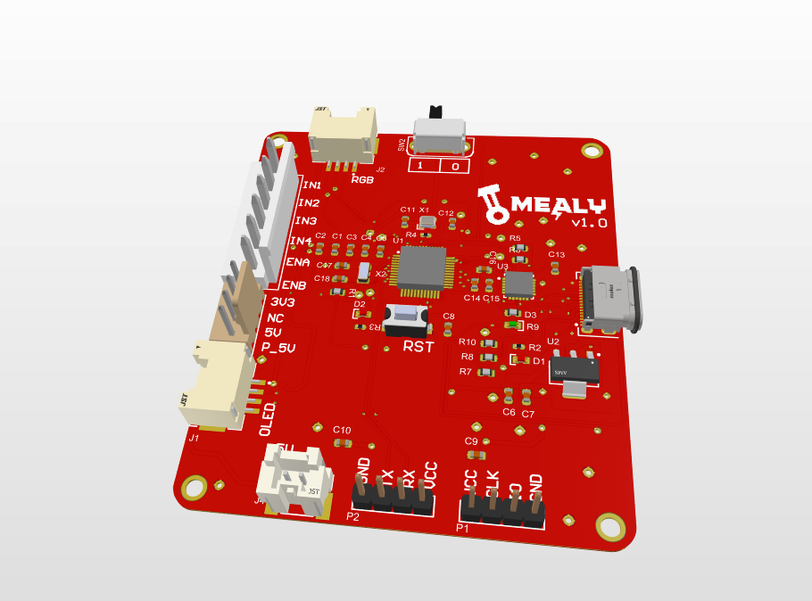
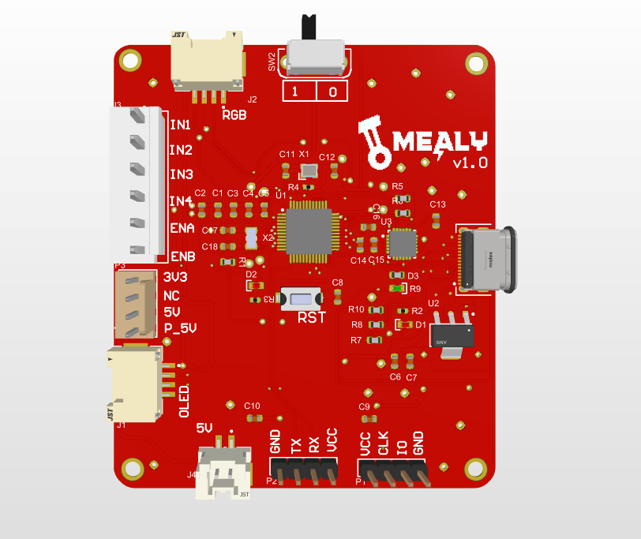

### Mealy PCB
### Introduction 
PCBs and Schematics for Mealy self-balancing robot: https://github.com/bytecod3/Mealy

Find the schematics and PCBs for robot control board in the ```Mealy``` folder. 

### Usage
The board has been designed using Altium designer. 
To use, download the repository as a zip file and open in Altium Designer (version 23.3.1)

## Images and screenshots for control board 
#### Top Orthographic


#### Left-edge


#### Back edge


#### Top 


